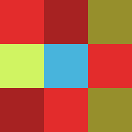
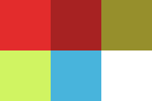

# TmxTools

TmxTools is a set of tools to help you work with TileMaps. Particularly with
those with a [.tmx](http://docs.mapeditor.org/en/latest/reference/tmx-map-format/) format.
It is written entirely in JavaScript, and can be used as a Node.js module or as
a command line utility.

## Turning a bitmap into a TileMap

One of the most basic functions of the **TmxTools** is to convert bitmap images to
TileMaps. The underlying idea is to provide the user with a means to develop a
TileMap in whatever drawing program of his choice, and then slice and dice
that bitmap and turn it into a TileMap. As if the user had created the
different Tiles by hand, and then crafted a Tile Map using them.

You can get a better idea of how this works, by looking at the examples folder
of this project. The simple folder under this directory contains a source image,
that would act as the input to the **TmxTools**, and a generated **.tmx** file.

_a sample input bitmap_



_and its corresponding Tile Set_



### Running
```
node src/index.js -s 64 -i ./examples/simple/test.png -o ./examples/simple/test.tmx
```
#### Options
**TmxTools** supports several options when run from the command line.

* -i The path to the input bitmap we would like to turn into a TileMap [required]
* -o The path to the output .tmx file where we would like to write our generated TileMap [required]
* -s Tile Size in pixels. Tiles are always squared, with a non zero, positive, power of two size.
  * 64 [default]
* -z Compression Algorithm.
  * gzip [default]
  * zlib
  * none

### Building
**TmxTools** makes use of several Node.js modules, which you will need to have
downloaded locally, before it can work its magic. The required modules are listed
in the package.json file, as in any classic Node.js application. In order
to download all required packages, go to your terminal window and type:
```
npm install
```
The project also has JsDoc documentation. In order to generate it, type:
```
npm run docs
```
### Running the Tests
**TmxTools** comes with a set of Unit Tests that use Mocha.js, Chai.js, etc. In order
to run them, simply type:
```
npm test
```

## Inspiration
TmxTools was first inspired by another OpenSource project,
[Image2Map.py](https://github.com/bjorn/tiled/wiki/Import-from-Image)
